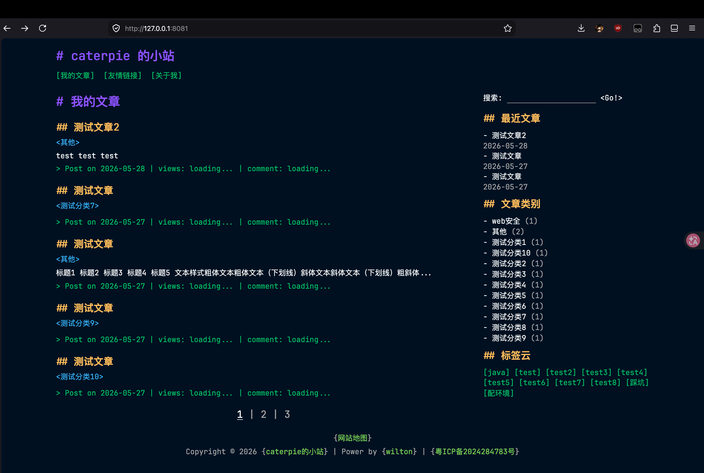
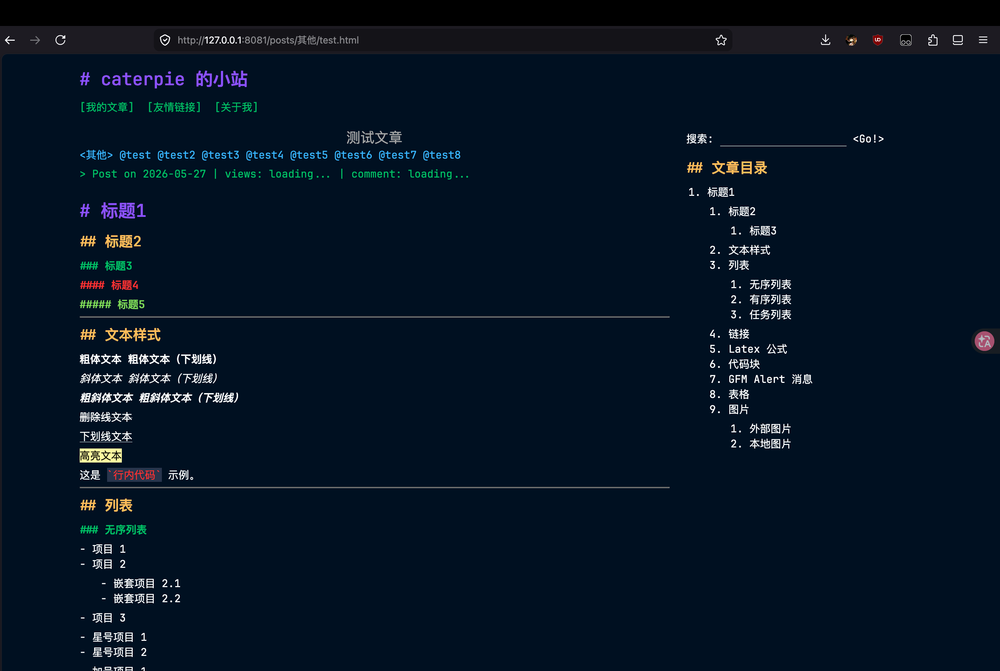
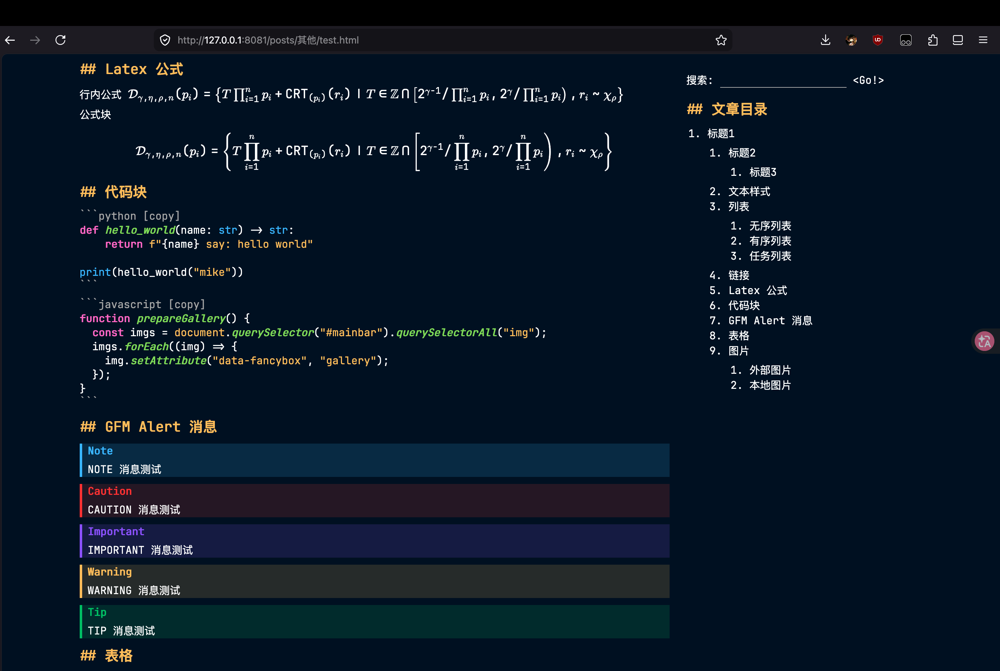
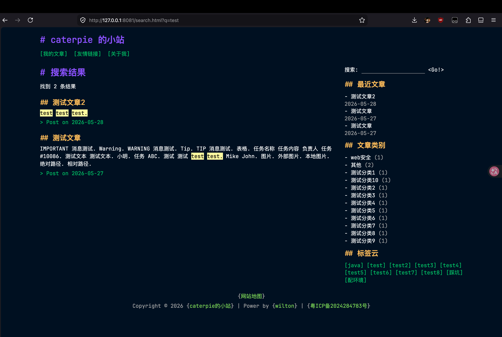

# wilton

为撰写技术博客设计的终端风格的静态站点生成器

> [!IMPORTANT]
> 现在还没写完, 代码混沌无序, 别用!

由于我发现自己每次想要仔细规划项目结构时, 最后都会陷入长时间的纠结以至于很多项目半路弃坑 (这个项目其实就是一个弃坑的项目, 只是我最近把它又翻出来了)

所以我决定使用最 "狂野" 的方式对待该项目:

* 全局变量满天飞, 维护怎么办? 不知道, 总之我写的时候很爽
* 当一件事有多种解决方式时, 使用脑子里第一个蹦出来的想法, 绝不花时间思考
* 我很懒且很急, 代码模块化完全随缘, 当我懒得思考时就会把东西全部塞到同一个文件
* 主打一个手搓风, AI 的建议一概不听, coding 爽!
* git commit 消息全由 AI 生成, 具体生成了啥直接不管, 反正我也不看
* 当我感到烦躁时我将不写注释

当然了, 这个项目其实很小, 就算我乱写后期维护也不会太难

目前我还是想尽快 "Make it work", 然后再慢慢分模块, 慢慢优化一些写法

访问量统计和评论区服务目前用的是腾讯的 EdgeOne, 后期会考虑加入更多平台的支持

## 部分外观展示

### 主页

### 文章阅读页面

### 搜索页

